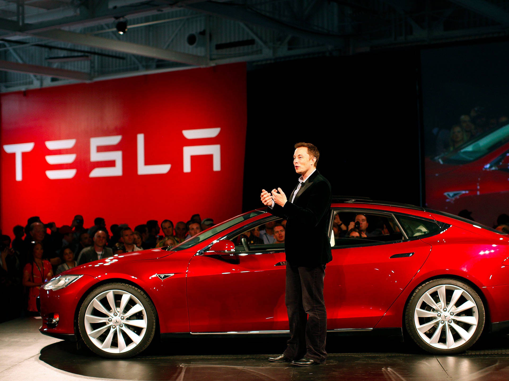

```{=html}
<style>
.centered {
  text-align: center;
  font-family: "Times New Roman", Times, serif;
  color: black; line-height: 2;
}
body {

  font-size: 12pt;
  font-family: "Times New Roman", Times, serif;
  margin: 0 auto;
  padding: 20px;
}
.content {
  text-align: left; 
  font-family: "Times New Roman", Times, serif;
  font-size: 11pt;
  color: black; line-height: 2;
}
</style>
```

:::: centered
```{=html}
<h1>Charging Forward: A Data-Driven Look at Electric Vehicles Population (in the State of Washington)</h1>

<h2>

Team members: <a href="https://quangnhatm1.github.io/">Minh Le</a> and Thu Nguyen

<h2>

<p>`r format(Sys.time(), '%d %B, %Y')`</p>



<u>Elon Musk stands proudly beside his Tesla at the debut of the company's latest product</u>
```
::::

::: content
### Electric Vehicle Adoption in Washington State: A Data-Driven Analysis
As the world transitions towards sustainable energy, electric vehicles (EVs) have emerged as a revolutionary force in the automotive industry. But which brands and models are actually driving this shift? Let take the State of Washington is an example, the Washington State Department of Licensing provides a dataset detailing EV registrations, offering insights into geographic distribution, popular models, and the influence of electric utility providers on adoption rates. This study explores how Washington's EV landscape has evolved, which brands and models dominate the market, and how electric range varies across different vehicle types, ultimately contributing to a broader understanding of the state's transition toward clean energy solutions.

### Which are electric vehicles ?
Electric vehicles are referred to as battery electric vehicles (BEVs) and plug-in hybrid electric vehicles (PHEVs), which improves vehicle efficiency.

### Below is the data set provided by Washington State Department of Licensing:

***Link to view/download the dataset: [EV Dataset](https://data.wa.gov/api/views/f6w7-q2d2/rows.csv?accessType=DOWNLOAD)***

```{r}
ev_data <- read.csv("Electric_Vehicle_Population_Data_1.csv", stringsAsFactors = FALSE)

library(DT)
datatable(ev_data,options = list(pageLength = 10,
                         scrollX = TRUE), 
          rownames = FALSE)
```

### Ready to Lauch the Data

```{r setup, include=FALSE, message=FALSE, warning=FALSE}
knitr::opts_chunk$set(echo = TRUE)

library(dplyr) # used to install tigris package
library(knitr) #for dynamic report generation
library(kableExtra) # used to construct Complex Table for data
library(tidyverse)# multiple tidy up data packages here
library(ggplot2) # used for data visualization
library(plotly) # make interactive graphs
library(DT)
library(leaflet)
library(ggmap)
library(mapview)
library(tigris)
library(sf)
```
### Our data: What's in it?

***It includes key attributes such as:***
# - Location details (County, City, State, Postal Code)
# - Vehicle specifications (Model Year, Make, Model)
# - EV classification (Electric Vehicle Type, Electric Range)
# - Electric utility provider

### Explore this data!

***To effectively analyze this data, my team has created the following questions could be explored:***

1. **How are electric vehicle (EV) types distributed across Washington?**  
2. **What is the relationship between model year and electric range? Does range improve over time?**  
3. **Which are the top 10 most common EV makes in Washington?**  
4. **What are the top 10 most common EV models in Washington?**  
5. **How does EV adoption vary by county? How does the distribution of electric vehicle types vary among the top five counties with the highest EV adoption?**  
6. **What trends can be observed in EV registrations over different model years?**  
7. **Which cities have the highest number of registered electric vehicles, and how can spatial mapping illustrate all of Washington cities in EV adoption?**  
8. **Are newer EV models becoming more efficient? **  
9. **Which EV models and their electric vehicle types tend to have the highest electric range ?**  
10. **Are certain EV manufacturers dominant in specific counties or regions?**  

This expanded set of questions will help uncover deeper insights into EV adoption trends and geographic patterns in Washington. Would you guys want to add more questions for me to analyze this beautiful data? 😊


### How are electric vehicle (EV) types distributed across Washington?
```{r}

ev_type_counts <- ev_data %>%
  count(Electric.Vehicle.Type)

ggplot(ev_type_counts, aes(x = Electric.Vehicle.Type, y = n, fill = Electric.Vehicle.Type)) +
  geom_col() +
  labs(title = "Distribution of EV Types", x = "Electric Vehicle Type", y = "Count") +
  theme_minimal() +
  theme(legend.position = "none")
```

### What is the relationship between model year and electric range? Does range improve over time?
```{r}
ggplot(ev_data, aes(x = Model.Year, y = Electric.Range)) +
  geom_point(alpha = 0.5, color = "darkblue") +
  labs(title = "Model Year vs Electric Range",
       x = "Model Year",
       y = "Electric Range (miles)") +
  theme_minimal()
```

### Which are the top 10 most common EV makes in Washington?
```{r}
ev_data %>%
  count(Make, sort = TRUE) %>%
  top_n(10) %>%
  ggplot(aes(x = reorder(Make, n), y = n)) +
  geom_col(fill = "steelblue") +
  coord_flip() +
  labs(title = "Top 10 Most Common EV Makes",
       x = "Make", y = "Number of Vehicles")
```

### What are the top 10 most common EV models in Washington?
```{r}
ev_data %>%
  count(Model, sort = TRUE) %>%
  top_n(10) %>%
  ggplot(aes(x = reorder(Model, n), y = n)) +
  geom_col(fill = "forestgreen") +
  coord_flip() +
  labs(title = "Top 10 Most Common EV Models",
       x = "Model", y = "Count")
```


### How does EV adoption vary by county? How does the distribution of electric vehicle types vary among the top five counties with the highest EV adoption?
```{r}
county_EV <- ev_data %>% group_by(County) %>% summarize(
  Total_EV = n()) %>% arrange(-Total_EV) %>%  rename(
    "Total EV"=Total_EV
  )

county_EV$County <- reorder(county_EV$County, county_EV$`Total EV`)

  counties <- ggplot(county_EV, aes(x = County, y = `Total EV`)) + 
  geom_bar(stat = "identity", fill = "red") +
  labs(title = "EV Adoption by County",
       x = "County",
       y = "Total EVs") +
  theme_minimal() +
  coord_flip()

ggplotly(counties)

top_counties <- county_EV %>%
  top_n(5, `Total EV`)
ev_top_counties <- ev_data %>%
  filter(County %in% top_counties$County) %>% rename(
    "Electric Vehicle Type" = Electric.Vehicle.Type)

county_top_types <- ggplot(ev_top_counties, aes(x = County, fill = `Electric Vehicle Type`)) +
  geom_bar(position = "dodge") +
  labs(title = "EV Adoption by Type in Top 5 Counties",
       x = "County",
       y = "Count of EVs") +
  theme_gray()
ggplotly(county_top_types)
```

### What trends can be observed in EV registrations over different model years?
```{r}

model_year_trends <- ev_data %>%
  group_by(Model.Year) %>%
  summarise(Total_Registrations = n()) %>%
  arrange(Model.Year) %>% 
  rename(
    "Model Year"=Model.Year,
    "Total Registrations"= Total_Registrations
  )
model_y <- ggplot(model_year_trends, aes(x = `Model Year`, y = `Total Registrations`)) +
  geom_line(color = "pink", linewidth = 1) +
  geom_point(size = 2) +
  labs(title = "EV Registrations by Model Year",
       x = "Model Year",
       y = "Total Registrations") +
  theme_gray()

ggplotly(model_y)
```

### Which cities have the highest number of registered electric vehicles, and how can spatial mapping illustrate all of Washington cities in EV adoption?
```{r}
city_EV <- ev_data %>%
  group_by(City) %>%
  summarise(Total_EV = n()) %>%
  arrange(-Total_EV) %>% 
  rename(
    "Total EV"=Total_EV
  )
city_EV1 <- city_EV %>% head(5)
city_EV1$City <- reorder(city_EV1$City,city_EV1$`Total EV`)
city_1<- ggplot(city_EV1, aes(x = City, y = `Total EV`)) +
  geom_col(fill = "purple") +
  labs(title = "EV Registrations by City", x = "City", y = "Total EVs")  
ggplotly(city_1)

wa_places <- places(state = "WA", year = 2021, progress = FALSE)
city_EV <- city_EV %>% 
  mutate(City = as.character(City))
city_map_data <- wa_places %>% 
  left_join(city_EV, by = c("NAME" = "City")) %>% 
  mutate(`Total EV` = replace_na(`Total EV`, 0))
ggplot(city_map_data) +
  geom_sf(aes(fill = `Total EV`), color = "gray30", linewidth = 0.3,alpha=.9) +
  scale_fill_gradientn(
    colors = c("#f0f9e8", "#bae4bc", "#7bccc4", "#43a2ca", "#0868ac"),
    na.value = "gray10",       
    name = "EV Count") +
  labs(title =  "Electric Vehicle Adoption in Washington Cities",
    subtitle = "Count of registered EVs by municipality") +
  theme_void()


```

### Are newer EV models becoming more efficient? (Model year vs. average range)

```{r}
ev_efficiency <- ev_data %>%
  group_by(Model.Year) %>%
  summarise(Average_Range = mean(Electric.Range, na.rm = TRUE)) %>%
  arrange(Model.Year) %>% 
  rename(
    "Model Year"= Model.Year,
    "Average Range"= Average_Range
  )

 ev_e <- ggplot(ev_efficiency, aes(x = `Model Year`, y = `Average Range`)) +
  geom_point(color = "orangered", size = 2) +
  geom_smooth() +
  labs(title = "EV Range Efficiency Over Model Years",
       x = "Model Year",
       y = "Average Electric Range (miles)") 
 ggplotly(ev_e)
```


### Which EV models and their electric vehicle types tend to have the highest electric range ?  
```{r}
top_ev_range <- ev_data %>% select(Model,Electric.Range,Electric.Vehicle.Type) %>% 
  group_by(Model,Electric.Vehicle.Type) %>%
  summarize(Max_Range = max(Electric.Range, na.rm = TRUE)) %>%
  arrange(-Max_Range) %>% head(10) %>% rename(
    "Max Range"= Max_Range,
    "Electric Vehicle Type" =Electric.Vehicle.Type
  )
top_ev_range$Model <- reorder(top_ev_range$Model,top_ev_range$"Max Range")

top_r <- ggplot(top_ev_range, aes(x = Model, y = `Max Range`,fill= `Electric Vehicle Type`)) +
  geom_col() +
  labs(title = "Top EV Models by Electric Range",
       x = "EV Model",
       y = "Max Electric Range (miles)") +
  coord_flip()
ggplotly(top_r)
```

### Are certain EV manufacturers dominant in specific counties or regions?

```{r}
ev_by_county <- ev_data %>%
  group_by(County, Make) %>%
  summarise(Total_EV = n(),.groups = "drop") %>%
  arrange(-Total_EV) %>%
  slice_max(Total_EV, by = County) %>% 
  rename(
    "Total EV"=Total_EV
  )
ev_by_county$County <- reorder(ev_by_county$County,ev_by_county$`Total EV`)
ev_county <- ggplot(ev_by_county, aes(x = County, y = `Total EV`, fill = Make)) +
  geom_col() +
  labs(title = "Dominant EV Manufacturer by County",
       x = "County",
       y = "Total EV Registrations") +
  theme_minimal() +
  coord_flip()
ggplotly(ev_county)
```
:::